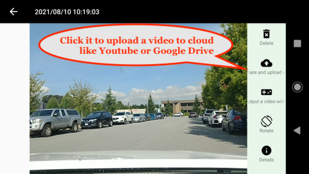

# Frequently Asked Questions

* [How Loop Recording work](#how-loop-recording-work)
* [What happens if the length of one video exceeds the file storage limitation?](#what-happens-if-the-length-of-one-video-exceeds-the-file-storage-limitation)
* [How to output the time stamp to a video?](#how-to-output-the-time-stamp-to-a-video)
* [How to record in the background?](#how-to-record-in-the-background)
* [How to stop the recording in the background easily?](#how-to-stop-the-recording-in-the-background-easily)
* [How to save needed videos to other places such as Google Drive, YouTube?](#how-to-save-needed-videos-to-other-places-such-as-google-drive-youtube)
* [Does this app support OBD interface?](#does-this-app-support-obd-interface)

## How Loop Recording work

When you go to the setting of this app, you can select the max storage size of all files.

For example, if you choose 10 GB, when the size of all recordings reaches 10GB, the app will start deleting the oldest recording.

## What happens if the length of one video exceeds the file storage limitation?

It will stop the current recording, and start a new one to override the current recording.

## How to output the time stamp to a video?

Go to the video player and select `Output a video with timestamp`. However, it does not support all devices. Some of old devices or certain devices using x86 CPU are unable to do this. You can go with the second option.

## How to record in the background?

## How to stop the recording in the background easily?

Drag the recording button in red to the close button. See the screenshot:

## How to save needed videos to other places such as Google Drive, YouTube?

## Does this app support OBD interface?

At the moment, I don't have OBD setup and device for testing. So it does not support OBD interface.
